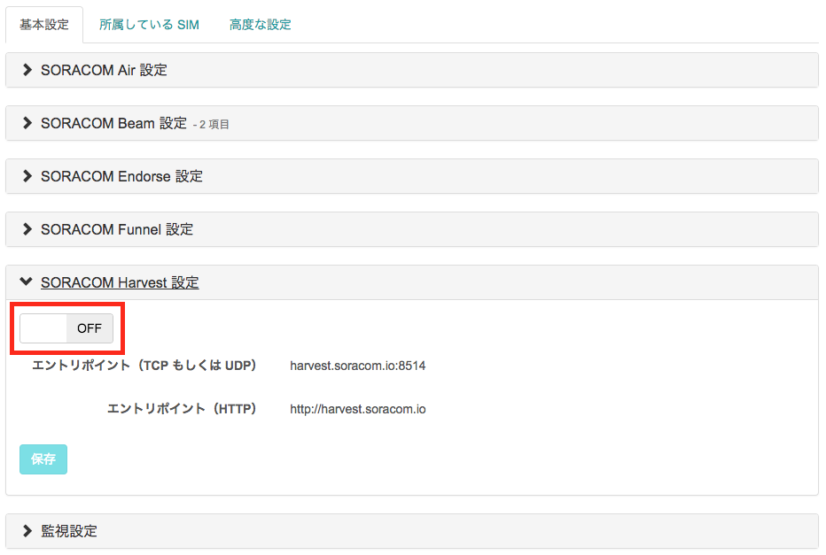
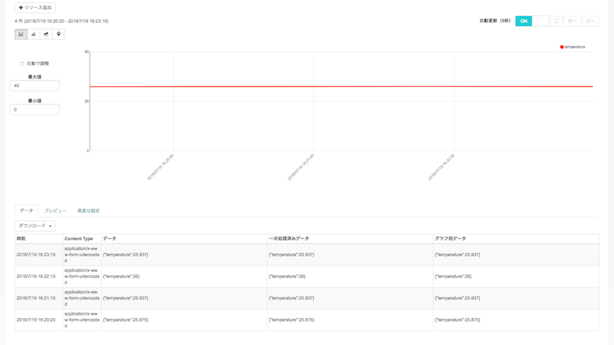

# IoT 体験キット 〜簡易監視カメラ〜

***

## 目次
- [はじめに](#section1)
- [概要](#section2)
- [必要なもの](#section3)

- [温度センサー DS18B20+ を使う](#section4)
  - [セットアップ](#section4-1)
  - [Harvestにデータを送る](#section4-2)
  - [ユーザコンソール上でデータを確認する](#section4-3)

- [USBカメラを使う](#section5)
  - [セットアップ](#section5-1)
  - [Webカメラとして使う](#section5-2)
  - [定点観測を行う](#section5-3)
  - [画像をクラウドにアップロードする](#section5-4)

- [おまけ](#section6)
  - [低速度撮影(time-lapse)動画を作成する](#section6-1)
  - [動画をストリーミングする](#section6-2)

***

## <a name="section1">はじめに</a>
このドキュメントは、ラズパイ(Raspberry Pi)と SORACOM の SIM を使って、観察したいものを定点観測するための仕組みを作る方法を解説します。簡易カメラの用途でもご利用いただけます。

カメラで撮影したデータと温度データをSORACOMを使ってクラウドに連携し、貯めたデータをタイムラプス動画として表示、温度のデータは SORACOM Harvest を使って可視化します。

[タイムラプス動画サンプル(YouTube)](https://www.youtube.com/watch?v=3--gMeGOV1I)

## <a name="section2">概要</a>
このキットを使うと、以下のような事ができます。

- 温度センサーからの温度データを、毎分アップロードし、可視化(グラフ化)する
- USBカメラで静止画を取り、クラウドストレージにアップロードして、スマホなどから確認する
- 撮りためた静止画を繋げて、タイムラプス動画を作成する


## <a name="section3">必要なもの</a>


1. SORACOM Air で通信が出来ている Raspberry Pi  
 - Raspberry Pi に Raspbian (2016-05-27-raspbian-jessie-lite.img を使用)をインストール
 - Raspberry Pi へ ssh で接続ができる(またはモニターやキーボードを刺してコマンドが実行出来る)
 - Raspberry Pi から SORACOM Air で通信が出来ている

  事前に[こちらのテキスト](../setup/setup.md)を参考に、SORACOM Air の接続ができているものとします
2. ブレッドボード
3. 温度センサー DS18B20+  
  Raspberry Piには接続しやすい、ADコンバータのいらない温度センサー
4. 抵抗 4.7 kΩ
  プルアップ抵抗
5. ジャンパワイヤ(オス-メス) x 3 (黒・赤・その他の色の３本を推奨)
6. USB接続のWebカメラ(Raspbianで認識出来るもの)

##  <a name="section4">温度センサー DS18B20+ を使う</a>
### <a name="section4-1">セットアップ</a>
#### <a name="section4-1.1">配線する</a>
Raspberry Pi の GPIO(General Purpose Input/Output)端子に、温度センサーを接続します。


使うピンは、3.3Vの電源ピン(01)、Ground、GPIO 4の３つです。


#### <a name="section4-1.2">Raspberry Pi でセンサーを使えるように設定する</a>
Raspberry Piの設定として、２つのファイルに追記して(以下の例ではcatコマンドで追記していますが、vi や nano などのエディタを利用してもよいです)、適用するために再起動します。

```
pi@raspberrypi:~ $ sudo su -
root@raspberrypi:~# cat >> /boot/config.txt
dtoverlay=w1-gpio-pullup,gpiopin=4
(Ctrl+Dを押します)

root@raspberrypi:~# cat >> /etc/modules
w1-gpio
w1-therm
(Ctrl+Dを押します)

root@raspberrypi:~# reboot
```

しばらく待つと、再起動が完了します。もう一度Raspberry Piにログインしてください。
* ログイン方法は[セットアップテキスト](../setup/setup.md#-raspberry-pi-への-ログイン)を参照してください。

ログインできたら、Raspberry Piがセンサーを認識できているか確認します。再起動後、センサーは /sys/bus/w1/devices/ 以下にディレクトリとして現れます(28-で始まるものがセンサーです)。

```
pi@raspberrypi:~ $ ls /sys/bus/w1/devices/
28-0000072431d2  w1_bus_master1
```

> トラブルシュート：
> もし28-で始まるディレクトリが表示されない場合は、配線が間違っている可能性があります

ファイル名は、センサー１つ１つ異なるIDがついています。センサー値を cat コマンドで読み出してみましょう。

```
pi@raspberrypi:~ $ cat /sys/bus/w1/devices/28-*/w1_slave
ea 01 4b 46 7f ff 06 10 cd : crc=cd YES
ea 01 4b 46 7f ff 06 10 cd t=30625
```

t=30625 で得られた数字は、摂氏温度の1000倍の数字となってますので、この場合は 30.625度となります。センサーを指で温めたり、風を送って冷ましたりして、温度の変化を確かめてみましょう。

> トラブルシュート：
> もし数値が０となる場合、抵抗のつなぎ方が間違っている可能性があります

### <a name="section4-2">SORACOM Harvest にデータを送信する</a>
センサーで取得した温度を可視化してみましょう。

本ハンズオンでは SORACOM Harvest を使ってデータの可視化行います。


#### <a name="4-2.1">SORCOM Harvest とは</a>
SORACOM Harvest(以下、Harvest) は、IoTデバイスからのデータを収集、蓄積するサービスです。

SORACOM Air が提供するモバイル通信を使って、センサーデータや位置情報等を、モバイル通信を介して容易に手間なくクラウド上の「SORACOM」プラットフォームに蓄積することができます。
保存されたデータには受信時刻や SIM の ID が自動的に付与され、「SORACOM」のユーザーコンソール内で、グラフ化して閲覧したり、API を通じて取得することができます。なお、アップロードされたデータは、40日間保存されます。


> 注意: SORACOM Harvest を使うには追加の費用がかかります  
> 書き込みリクエスト: 1日 2000リクエストまで、1SIMあたり 1日5円  
> 1日で2000回を超えると、1リクエスト当り0.004円  

#### <a name="4-2.2">SORACOM Harvest を有効にする</a>
SORACOM Harvest を使うには、Group の設定で、Harvest を有効にする必要があります。

グループ設定を開き、SORACOM Harvest を開いて、ON にして、保存を押します。



#### <a name="4-2.3">プログラムのダウンロード・実行</a>

#### コマンド
```
curl -O http://soracom-files.s3.amazonaws.com/temperature.sh
bash temperature.sh
```

#### 実行結果
```
pi@raspberrypi:~ $ curl -O http://soracom-files.s3.amazonaws.com/temperature.sh
  % Total    % Received % Xferd  Average Speed   Time    Time     Time  Current
                                 Dload  Upload   Total   Spent    Left  Speed
100   519  100   519    0     0    310      0  0:00:01  0:00:01 --:--:--   310
pi@raspberrypi:~ $ bash temperature.sh
sending payload={"temperature":25.437}  ... done.
```

##### トラブルシュート
以下のようなエラーメッセージが出た場合には、設定を確認して下さい
- `{"message":"No group ID is specified: xxxxxxxxxxxxxxx"}` → SIM にグループが設定されていない
- `{"message":"Configuration for SORACOM Harvest is not found"}`  → グループで Harvest を有効にしていない

### <a name="section4-3">ユーザコンソールで可視化されたデータを確認する</a>
コンソールから、送信されたデータを確認してみましょう。

SIMを選択して、操作から「データを確認」を選びます。


下記のようなグラフが表示されていると思います。



スクリプトのデフォルト設定では60秒に一度データが送信されます。自動更新のボタンをオンにすると、グラフも自動的に更新されます。

とても簡単に可視化が出来たのがおわかりいただけたと思います。

## <a name="section5">USBカメラを使う</a>
Raspberry Pi に USBのカメラ(いわゆるWebカメラ)を接続してみましょう。本キットでは Buffalo 社の　BSWHD06M シリーズを使用しています。

### <a name="section5-1">セットアップ</a>
#### <a name="section5-1.1">接続</a>
USB カメラは、Raspberry Pi の USB スロットに接続して下さい。


#### <a name="section5-1.2">パッケージのインストール</a>
fswebcam というパッケージを使用します。apt-getコマンドでインストールして下さい。

```
pi@raspberrypi:~ $ sudo apt-get install -y fswebcam
```

> トラブルシュート：  
> E: Unable to fetch some archives, maybe run apt-get update or try with --fix-missing?  
> と表示されたら、 sudo apt-get update を行ってから、再度 apt-get install してみてください

#### <a name="section5-1.3">コマンドラインによるテスト撮影</a>
インストールが出来たら、実際に撮影してみましょう。先ほどインストールした、fswebcam コマンドを使います。 -r オプションで解像度を指定する事が出来ます。

```
pi@raspberrypi:~ $ fswebcam -r 640x480 test.jpg
--- Opening /dev/video0...
Trying source module v4l2...
/dev/video0 opened.
No input was specified, using the first.
--- Capturing frame...
Captured frame in 0.00 seconds.
--- Processing captured image...
Writing JPEG image to 'test.jpg'.
```

scp コマンドなどを使って、PCにファイルを転送して開いてみましょう。

##### <a name="section5-1.3.1">Macの場合</a>
**この操作はお手元のMacで行ってください。Raspberry Piにログインする必要はありません。**

新しいTerminalウィンドウを開き以下のコマンドを実行します。

```
~$ scp pi@raspberrypi.local:test.jpg .
pi@raspberrypi.local's password:
test.jpg                                      100%  121KB 121.0KB/s   00:00    

~$ open test.jpg
```


##### <a name="section5-1.4">Windowsの場合</a>
WinSCPなど、SCPできるアプリケーションをインストールすると、手元のPCに画像を転送できます。
もし難しければ、次に進んで Web ブラウザ経由でも確認出来ますので、スキップして構いません

### <a name="section5-2">Webカメラとして使う</a>
**この操作はRaspberry Piにログインして行います。Raspberry PiにSSH接続したウィンドウでコマンドを実行してください。**

Raspberry PiをWebサーバにして、アクセスした時にリアルタイムの画像を確認できるようにしてみましょう。

まずapache2 パッケージをインストールします
```
pi@raspberrypi:~ $ sudo apt-get install -y apache2
```

インストールが出来たら、CGIが実行出来るようにします。
```
pi@raspberrypi:~ $ sudo ln -s /etc/apache2/mods-available/cgi.load /etc/apache2/mods-enabled/

pi@raspberrypi:~ $ sudo gpasswd -a www-data video
Adding user www-data to group video

pi@raspberrypi:~ $ sudo service apache2 restart
```

最後にCGIプログラムをダウンロードして設置します。
```
pi@raspberrypi:~ $ sudo wget -O /usr/lib/cgi-bin/camera https://soracom-files.s3.amazonaws.com/camera

--2016-07-14 08:04:34--  https://soracom-files.s3.amazonaws.com/camera
Resolving soracom-files.s3.amazonaws.com (soracom-files.s3.amazonaws.com)... 54.231.225.58
Connecting to soracom-files.s3.amazonaws.com (soracom-files.s3.amazonaws.com)|54.231.225.58|:443... connected.
HTTP request sent, awaiting response... 200 OK
Length: 374 [text/plain]
Saving to: ‘camera’

camera              100%[=====================>]     374  --.-KB/s   in 0s     

2016-07-14 08:04:35 (1.45 MB/s) - ‘camera’ saved [374/374]

pi@raspberrypi:~ $ sudo chmod +x /usr/lib/cgi-bin/camera
```

ここまで設定をしたら、Webブラウザでアクセスしてみましょう。

http://raspberrypi.local/cgi-bin/camera

> Windowsの場合や、複数のRaspberry PiがLAN内にある場合には、http://{RaspberryPiのIPアドレス}/cgi-bin/camera でアクセスをしてみて下さい。

リロードをするたびに、新しく画像を撮影しますので、撮影する対象の位置決めをする際などに使えると思います。  
一度位置を固定したら、カメラの位置や対象物の下にビニールテープなどで位置がわかるように印をしておくとよいでしょう。

### <a name="section5-3">定点観測を行う</a>
毎分カメラで撮影した画像を所定のディレクトリに保存してみましょう。

#### <a name="section5-3.1">準備</a>

まず保存するディレクトリを作成して、アクセス権限を変更します。

```
pi@raspberrypi:~ $ sudo mkdir /var/www/html/images

pi@raspberrypi:~ $ sudo chown -R pi:pi /var/www/html/
```

#### <a name="section5-3.2">スクリプトのダウンロードと実行</a>

次にスクリプトをダウンロードしてテスト実行してみましょう。

```
pi@raspberrypi:~ $ wget http://soracom-files.s3.amazonaws.com/take_picture.sh
--2016-07-19 02:19:01--  http://soracom-files.s3.amazonaws.com/take_picture.sh
Resolving soracom-files.s3.amazonaws.com (soracom-files.s3.amazonaws.com)... 54.231.228.9
Connecting to soracom-files.s3.amazonaws.com (soracom-files.s3.amazonaws.com)|54.231.228.9|:80... connected.
HTTP request sent, awaiting response... 200 OK
Length: 444 [text/plain]
Saving to: ‘take_picture.sh’

take_picture.sh           100%[====================================>]     444  --.-KB/s   in 0.001s

2016-07-19 02:19:01 (451 KB/s) - ‘take_picture.sh’ saved [444/444]

pi@raspberrypi:~ $ chmod +x take_picture.sh

pi@raspberrypi:~ $ ./take_picture.sh
checking current temperature ... 29.75 [c]
taking picture ...
--- Opening /dev/video0...
Trying source module v4l2...
/dev/video0 opened.
No input was specified, using the first.
--- Capturing frame...
Captured frame in 0.00 seconds.
--- Processing captured image...
Setting title "Temperature: 29.75 (c)".
Writing JPEG image to '201607190219.jpg'.
```

現在の温度を取得して、温度をキャプションとした画像を保存する事に成功しました。

http://raspberrypi.local/images/
> Windowsの場合や、複数のRaspberry PiがLAN内にある場合には、http://{RaspberryPiのIPアドレス}/images でアクセスをしてみて下さい。

にアクセスするとファイルが出来ていると思います。

あとはこれを定期的に実行するように設定しましょう。

#### <a name="section5-3.3">cron設定</a>

先ほどの温度センサー情報と同じく、cronの設定を行います。crontabを編集して設定を追加しましょう。

以下のコマンドを実行し、crontabの編集画面を開きます。

```
pi@raspberrypi:~ $ crontab -e
no crontab for root - using an empty one

Select an editor.  To change later, run 'select-editor'.
  1. /bin/ed
  2. /bin/nano        <---- easiest
  3. /usr/bin/vim.tiny

Choose 1-3 [2]: 2 （2を選択します）
crontab: installing new crontab
```

編集画面が開いたら、以下のように crontab に追記すると、毎分撮影となります。

```
* * * * * ~/take_picture.sh &> /dev/null
```

画像サイズは場合にもよりますが、640x480ドットでだいたい150キロバイト前後になります。
もし毎分撮った場合には、１日に約210MB程度の容量となります。
画像を撮る感覚が狭ければ狭いほど、より滑らかな画像となりますが、SDカードの容量には限りがありますので、もし長期に渡り撮影をするのであれば、

```
*/5 * * * * ~/take_picture.sh &> /dev/null
```

のように５分毎に撮影を行ったり、

```
0 * * * * ~/take_picture.sh &> /dev/null
```

のように毎時０分に撮影を行ったりする事で、間隔を間引いてあげるとよいでしょう。

設定を書き込んだら、[Ctrl+W] を押して保存し、[Ctrl+X] を押してcrontab編集画面を閉じてください。

### <a name="section5-4">画像をクラウドにアップロードする</a>
撮影した画像をインターネットから参照出来るように、クラウドストレージにアップロードしてみましょう。
その際、画像がどのSIMを持つデバイスから送信されたのかを証明するために、SORACOM Endorse を利用します。

#### <a name="section5-4.1">SORACOM Endorse とは</a>
SORACOM Endorse(以下、Endorse) は、Air SIM を使用しているデバイスに対して、SORACOM が認証プロバイダーとしてデバイスの認証サービスを提供します。 SIM を使用した認証を Wi-Fi などの SIM 以外の通信にも使うことが可能となります。


Air SIM で接続後、Endorse に対して認証トークンの発行リクエストを送ると、Endorse が IMSI、IMEI などのデータを含んだ認証トークンを発行します。このトークンは SORACOM の秘密鍵で署名がされています。

デバイスがこのトークンをサーバーに送信すると、サーバー側はこのトークンが SORACOM が発行した正しいものかどうかを、SORACOM の公開鍵で検証することができます。一旦トークンの受け渡しが終われば、サーバーは接続元のデバイスがどの SIM を持っているかを把握できるため、例えばそのままサーバーにログインするような仕組みを作ることもできます。そして一旦認証トークンの受け渡しが終わり認証が完了すれば、接続経路が Air SIM ではなく、Wi-Fi を使用していても、利用者のシステムではどの SIM から接続されているのかを確かなものとして扱うことができます。

### <a name="section5-5">システム構成</a>
下図のような仕組みで、画像をアップロードします。


1. SORACOM Endorse にアクセスをしてトークンを取得
2. 一番最近撮影した画像に、1. で得られたトークン情報をカスタムヘッダとして付与して、アップロード
3. AWS上のプログラム(Lambda)でヘッダ(トークン)が正しいものかどうかを確認し、正しいものと確認できた場合にのみ公開用の領域にコピー
4. スマホ等からIMSI毎の公開URLにアクセスすると、アップロードされた画像にアクセスできます

> 3番のクラウド側の処理は、SORACOM側で用意してあります

### <a name="section5-6">設定</a>
#### SORACOM Endorse設定
SORACOM Endose を有効にします。

1. グループ設定画面で、SORACOM Endorseを開き、下記のように IMSI にチェックボックスを入れて、保存を押します

2. 下記のようなダイアログが表示されますので、OKを押します


SORACOM 側の設定は以上になります。

> アカウント作成から１年以内であれば、無料利用枠に SORACOM Endorse の SIMカード１枚分が無料となります
> ２枚以上でEndorseを有効にしたり、作成から１年以上経ちましたアカウントでは、追加の料金が発生する旨、お気をつけください

### <a name="section5-6.2">Raspberry Pi設定</a>
次に Raspberry Pi の設定を行います。

#### PyJWT のインストール
Python で Endorse で使われている JWT(JSON Web Token) を扱うためのライブラリ、PyJWTをインストールします。
```
pi@raspberrypi:~ $ sudo pip install pyjwt
Downloading/unpacking pyjwt
  Downloading PyJWT-1.4.1-py2.py3-none-any.whl
Installing collected packages: pyjwt
Successfully installed pyjwt
Cleaning up...
```

#### スクリプトのダウンロード＆実行
```
pi@raspberrypi:~ $ wget http://soracom-files.s3.amazonaws.com/upload_image.py
--2016-07-22 05:27:36--  http://soracom-files.s3.amazonaws.com/upload_image.py
Resolving soracom-files.s3.amazonaws.com (soracom-files.s3.amazonaws.com)... 52.219.4.1
Connecting to soracom-files.s3.amazonaws.com (soracom-files.s3.amazonaws.com)|52.219.4.1|:80... connected.
HTTP request sent, awaiting response... 200 OK
Length: 1073 (1.0K) [text/plain]
Saving to: ‘upload_image.py’

upload_image.py                     100%[====================================================================>]   1.05K  --.-KB/s   in 0s

2016-07-22 05:27:36 (32.9 MB/s) - ‘upload_image.py’ saved [1073/1073]

pi@raspberrypi:~ $ python upload_image.py /var/www/html/image.jpg
- SORACOM Endorse にアクセスして token を取得中 ...
{
    "aud": "soracom-endorse-audience",
    "iss": "https://soracom.io",
    "soracom-endorse-claim": {
        "imsi": "440101111111111"
    },
    "jti": "kENUDfNrej4LE2N1VQawlQ",
    "exp": 1469165906,
    "iat": 1469165306,
    "nbf": 1469165246,
    "sub": "soracom-endorse"
}
- Amazon S3 にファイルをアップロード中 ...
PUT https://soracom-handson.s3.amazonaws.com/incoming/camera/kENUDfNrej4LE2N1VQawlQ
status: 200
```

最後に status が 200 となっていれば、アップロードが無事完了しています。

アップロードが完了してから数秒おいて、 ```http://soracom-handson.s3.amazonaws.com/camera/{IMSI}``` にアクセスすると、アップロードした画像にアクセスすることが出来ます。

#### 定期的な実行(cron設定)
毎分撮影したとしても、必ずしも毎分画像をアップロードする必要はありません。  
仮に画像サイズが平均150KBであるとすると、月間の転送にかかる費用(s1.minimumを使用した場合)は、下記のようになります。

|頻度|転送回数/月|転送容量/月|概算費用/月|
|---|---:|---:|---:|
|毎分|43200|約 6.3GB|約 1265円|
|5分毎|8640|約 1.3GB|約 253円|
|10分毎|4320|約 0.6GB|約 126円|

用途やニーズに合わせて頻度を調整してみるとよいでしょう。

頻度の調整は、やはりcronの設定で行います。

##### 毎分
```
* * * * * python upload_image.py /var/www/html/image.jpg &> /dev/null
```

##### ５分毎
```
*/5 * * * * python upload_image.py /var/www/html/image.jpg &> /dev/null
```

しばらくしてから、先ほどのURLをリロードし、画像が更新されていることを確かめましょう。

## <a name="section6">おまけ</a>
### <a name="section6-1">低速度撮影(time-lapse)動画を作成する</a>
撮りためた画像を使用して、低速度撮影(タイムラプス)動画を作成してみましょう。

植物の成長や雲の動きなど、ゆっくり変化をするようなものを一定間隔(例えば１分毎)に撮影した画像を使って、仮に１秒間に30コマ使用すると１時間が動画では約２秒となるような動画を作成する事が出来ます。こういった映像を「低速度撮影(タイムラプス)映像」と呼びます。

#### パッケージのインストール
動画へのコンバートには、avconv というプログラムを利用しますので、下記のコマンドでパッケージをインストールして下さい。

```
pi@raspberrypi:~ $ sudo apt-get install -y libav-tools
```

非常に多くのパッケージをダウンロードしますので、少し時間がかかります。3G接続を切って有線接続でインストールした方がよいかもしれません。

#### スクリプトのダウンロード
スクリプトをダウンロードします。

```
pi@raspberrypi:~ $ wget http://soracom-files.s3.amazonaws.com/timelapse.sh
--2016-08-02 09:13:16--  http://soracom-files.s3.amazonaws.com/timelapse.sh
Resolving soracom-files.s3.amazonaws.com (soracom-files.s3.amazonaws.com)... 52.219.16.1
Connecting to soracom-files.s3.amazonaws.com (soracom-files.s3.amazonaws.com)|52.219.16.1|:80... connected.
HTTP request sent, awaiting response... 200 OK
Length: 1262 (1.2K) [text/plain]
Saving to: ‘timelapse.sh’

timelapse.sh                100%[===========================================>]   1.23K  --.-KB/s   in 0s

2016-08-02 09:13:16 (41.6 MB/s) - ‘timelapse.sh’ saved [1262/1262]

pi@raspberrypi:~ $ chmod +x timelapse.sh

pi@raspberrypi:~ $ ./timelapse.sh
Usage: ./timelapse.sh [options] /full/path/to/output.mp4
Options:
 -d /path/to/images/ (default=/var/www/html/images/)
 -f filter_string (default=no filter)
 -s N (speed, default=30 frames per seconds)
```

引数なしで実行すると、コマンドの説明が表示されます。

```
使い方: ./timelapse.sh [options] /full/path/to/output.mp4 # 出力するMP4ファイルへのフルパス
Options:
 -d /path/to/images/ (default=/var/www/html/images/) # 元となる画像の格納場所
 -f filter_string (default=no filter) # ファイル名のフィルタ
 -s N (speed, default=30 frames per seconds) # スピード、デフォルトでは 30枚/秒、１分に一回撮影したものであれば、30分/秒となる
```

それでは、実際に画像を動画を変換してみましょう。

オプションをを指定しない場合、/var/www/html/images 以下の画像ファイルを全て使用して、動画を作成します。
変換が終わった後の動画をすぐにブラウザで見れるように、/var/www/html/ 以下に動画ファイルを出力しておくと便利です。
画像の枚数やラズパイのバージョンによって変換にかかる時間が変わるので、変換が終わるまで気長に待ちましょう。

```
pi@raspberrypi:~ $ ./timelapse.sh /var/www/html/timelapse.mp4
-- 1. mkdir /var/tmp/time-lapse-2043 for workspace
-- 2. symlinking images as seqeuntial filename (it may take a while...)
288 files found.

-- 3. converting jpeg files to MPEG-4 video (it may also take a while...)
avconv version 11.6-6:11.6-1~deb8u1+rpi1, Copyright (c) 2000-2014 the Libav developers
  built on Mar 22 2016 15:53:22 with gcc 4.9.2 (Raspbian 4.9.2-10)
Input #0, image2, from '%08d.jpg':
  Duration: 00:00:09.60, start: 0.000000, bitrate: N/A
    Stream #0.0: Video: mjpeg, yuvj420p, 640x480 [PAR 96:96 DAR 4:3], 30 fps, 30 tbn
[libx264 @ 0x19d8040] using SAR=1/1
[libx264 @ 0x19d8040] using cpu capabilities: ARMv6 NEON
[libx264 @ 0x19d8040] profile High, level 3.0
[libx264 @ 0x19d8040] 264 - core 142 r2431 a5831aa - H.264/MPEG-4 AVC codec - Copyleft 2003-2014 - http://www.videolan.org/x264.html - options: cabac=1 ref=3 deblock=1:0:0 analyse=0x3:0x113 me=hex subme=7 psy=1 psy_rd=1.00:0.00 mixed_ref=1 me_range=16 chroma_me=1 trellis=1 8x8dct=1 cqm=0 deadzone=21,11 fast_pskip=1 chroma_qp_offset=-2 threads=6 lookahead_threads=1 sliced_threads=0 nr=0 decimate=1 interlaced=0 bluray_compat=0 constrained_intra=0 bframes=3 b_pyramid=2 b_adapt=1 b_bias=0 direct=1 weightb=1 open_gop=0 weightp=2 keyint=250 keyint_min=25 scenecut=40 intra_refresh=0 rc_lookahead=40 rc=crf mbtree=1 crf=23.0 qcomp=0.60 qpmin=0 qpmax=69 qpstep=4 ip_ratio=1.40 aq=1:1.00
Output #0, mp4, to '/var/www/html/timelapse.mp4':
  Metadata:
    encoder         : Lavf56.1.0
    Stream #0.0: Video: libx264, yuv420p, 640x480 [PAR 1:1 DAR 4:3], q=-1--1, 30 fps, 30 tbn, 30 tbc
    Metadata:
      encoder         : Lavc56.1.0 libx264
Stream mapping:
  Stream #0:0 -> #0:0 (mjpeg (native) -> h264 (libx264))
Press ctrl-c to stop encoding
frame=  288 fps=  8 q=-1.0 Lsize=     674kB time=9.50 bitrate= 581.1kbits/s    its/s
video:669kB audio:0kB other streams:0kB global headers:0kB muxing overhead: 0.798229%
[libx264 @ 0x19d8040] frame I:2     Avg QP:23.87  size: 21094
[libx264 @ 0x19d8040] frame P:83    Avg QP:24.61  size:  5384
[libx264 @ 0x19d8040] frame B:203   Avg QP:26.61  size:   960
[libx264 @ 0x19d8040] consecutive B-frames:  0.7%  4.9% 33.3% 61.1%
[libx264 @ 0x19d8040] mb I  I16..4:  5.7% 84.4% 10.0%
[libx264 @ 0x19d8040] mb P  I16..4:  1.9%  6.2%  0.2%  P16..4: 53.0% 12.1%  6.7%  0.0%  0.0%    skip:20.0%
[libx264 @ 0x19d8040] mb B  I16..4:  0.2%  0.4%  0.0%  B16..8: 28.8%  1.1%  0.2%  direct: 1.1%  skip:68.1%  L0:44.1% L1:53.2% BI: 2.7%
[libx264 @ 0x19d8040] 8x8 transform intra:75.8% inter:82.4%
[libx264 @ 0x19d8040] coded y,uvDC,uvAC intra: 56.5% 72.5% 32.5% inter: 14.1% 20.1% 0.6%
[libx264 @ 0x19d8040] i16 v,h,dc,p: 33% 42% 13% 12%
[libx264 @ 0x19d8040] i8 v,h,dc,ddl,ddr,vr,hd,vl,hu: 21% 24% 37%  2%  3%  2%  5%  2%  6%
[libx264 @ 0x19d8040] i4 v,h,dc,ddl,ddr,vr,hd,vl,hu: 26% 29% 18%  3%  4%  3%  7%  4%  6%
[libx264 @ 0x19d8040] i8c dc,h,v,p: 57% 23% 18%  2%
[libx264 @ 0x19d8040] Weighted P-Frames: Y:49.4% UV:18.1%
[libx264 @ 0x19d8040] ref P L0: 48.9% 22.8% 15.6%  9.1%  3.6%
[libx264 @ 0x19d8040] ref B L0: 64.0% 28.6%  7.4%
[libx264 @ 0x19d8040] ref B L1: 84.2% 15.8%
[libx264 @ 0x19d8040] kb/s:569.96

-- 4. cleanup...
```

上記の例で出力されたファイルは、 http://raspberrypi.local/timelapse.mp4 でアクセスする事が出来ます。

[サンプル動画](http://soracom-files.s3.amazonaws.com/timelapse.mp4)

### <a name="section6-2">動画をストリーミングする</a>
Coming soon...
